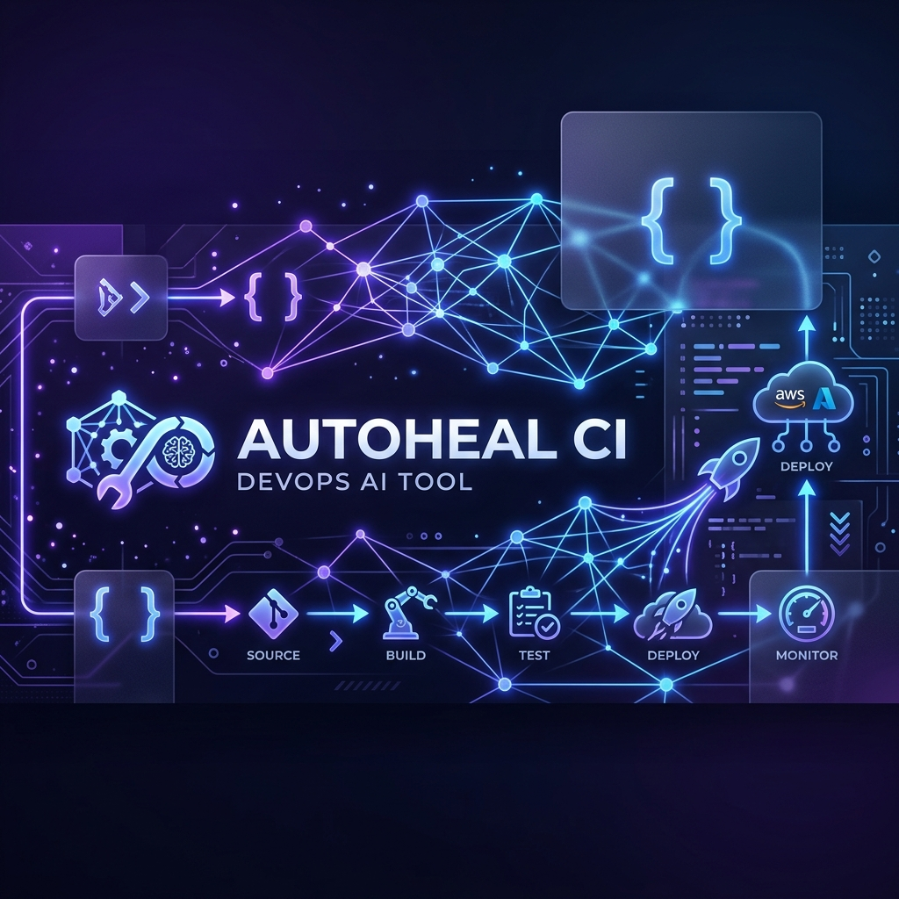
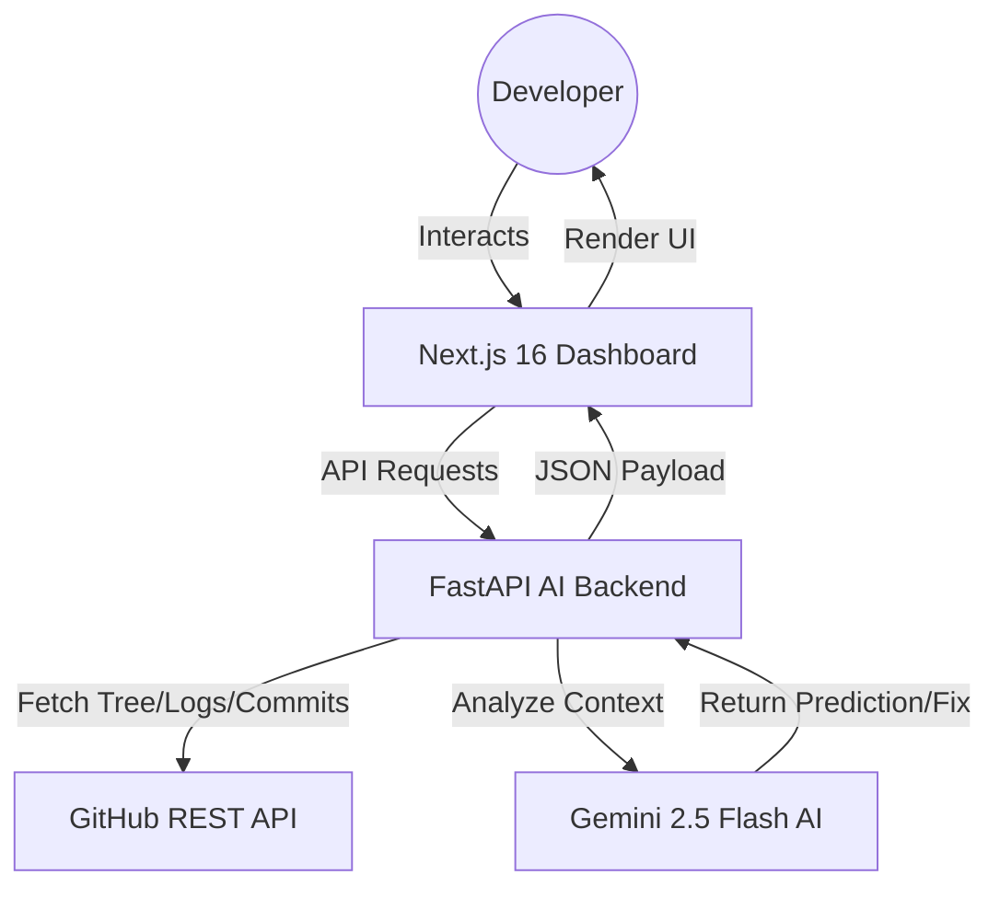

<div align="center">



# ⚡ AutoHeal CI

### AI-Powered CI/CD Predictive Platform & Automated Healing Engine

[](https://nextjs.org/)
[](https://fastapi.tiangolo.com/)
[](https://ai.google.dev/)
[](https://tailwindcss.com/)

<p align="center">
  <b>Predict deployment failures, analyze workflow logs with AI, and heal your CI/CD pipelines before they even break.</b>
  <br />
  Built for high-performance DevOps teams looking for the "Studio Zen" developer experience.
</p>

[Explore Dashboard](#-getting-started) • [Key Features](#-key-features) • [Architecture](#-technical-architecture) • [Setup Guide](#-setup-guide)

</div>

---

## 💡 The Problem
Modern CI/CD pipelines are often "black boxes" that fail for predictable reasons—dependency drifts, configuration errors, or subtle code conflicts. Developers shouldn't have to wait 20 minutes for a pipeline to fail just to see a common error log.

## ✨ The Solution: AutoHeal CI
AutoHeal CI integrates directly with the **GitHub API** to provide an AI-infused layer over your existing workflows. It doesn't just show you what happened; it **predicts what will happen** and tells you **how to fix it**.

---

## 🚀 Key Features

### 🧠 AI-Powered Predictions
Utilizes **Gemini 2.5 Flash** to analyze repository structure, CI/CD configurations (`.github/workflows`, `Jenkinsfile`), and dependency files to predict pipeline success with a calculated risk score.

### 💨 Lightning-Fast Repository Scanning
Uses the **GitHub Git Trees API** to recursively map entire repositories (thousands of files) in milliseconds. No more slow, sequential file-by-file fetching.

### 📊 Live Pipeline Visualizer
A premium, interactive dashboard built with **Framer Motion** and **Recharts**. Monitor your build history, success rates, and average durations with stunning glassmorphic UI components.

### 🔍 Real-Time Log Streaming
Drill down into specific workflow jobs and steps. Fetch real logs directly from GitHub and have the AI analyze failures on-the-fly to suggest instant patches.

### 🔄 Multi-Repo Context
Seamlessly switch between multiple connected repositories using a global context-aware repository selector.

---

## 🏗️ Technical Architecture



---

## 🛠️ Technology Stack

| Layer | Technology |
|---|---|
| **Frontend** | Next.js 16 (App Router), React 19, Framer Motion, Tailwind CSS v4, Lucide Icons |
| **Backend** | Python 3.13, FastAPI, Uvicorn, HTTPX (Asynchronous Client) |
| **AI Engine** | Google Generative AI (Gemini 2.5 Flash) |
| **Data Flow** | Recharts (Analytics), React Context (State Management) |

---

## 📖 Setup Guide

### 1. Prerequisites
- **Git** & **Node.js** (v18+)
- **Python 3.10+** & **pip**
- [Gemini API Key](https://aistudio.google.com/app/apikey)
- [GitHub Personal Access Token](https://github.com/settings/tokens) (Scope: `repo`, `workflow`)

### 2. Backend Installation (Terminal 1)
```bash
cd autoheal-backend
python -m venv venv
source venv/bin/activate  # Windows: .\venv\Scripts\activate
pip install -r requirements.txt
```
Create a `.env` file in `autoheal-backend/`:
```env
GITHUB_ACCESS_TOKEN=your_github_token
GEMINI_API_KEY=your_gemini_key
```
Run the server:
```bash
python main.py
```

### 3. Frontend Installation (Terminal 2)
```bash
cd autoheal-ci
npm install
npm run dev
```

Visit `http://localhost:3000` and connect your first public repository to see the magic happen!

---

<div align="center">
  <p>Made with ❤️ for the DevOps community.</p>
  <sub>AutoHeal CI - Version 1.2.0 - Studio Zen Design</sub>
</div>
